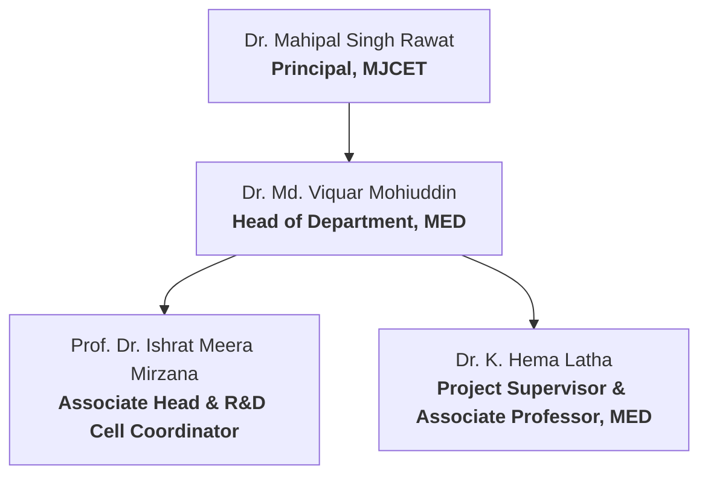

import { Badge } from '@astrojs/starlight/components';

This section details the academic oversight, student team composition, institutional credentials, and supervisory approval metadata associated with the development of the **Smart Agri Four Legged Bot** (2024-2025).

---

## Institutional Metadata

| Metric | Detail |
| :--- | :--- |
| **Institution** | Muffakham Jah College of Engineering and Technology (MJCET) |
| **Location** | Banjara Hills, Hyderabad - 500034, Telangana, India |
| **Affiliation** | Affiliated to Osmania University, Hyderabad |
| **Approvals & Accreditations** | Approved by AICTE, Accredited by NBA |
| **Academic Division** | Department of Mechanical Engineering (MED) |
| **Research Context** | Research and Development Cell (R&D) Project Completion Report |
| **Academic Program** | Bachelor of Engineering in Mechanical Engineering |
| **Academic Year** | 2024–2025 |

---

## Academic Guidance & Leadership

The project was carried out under the direct guidance, review, and administrative support of the following faculty members:

*   **Project Supervisor**: **Dr. K. Hema Latha** (Associate Professor, MED, MJCET)
*   **Head of Department (MED)**: **Dr. Md. Viquar Mohiuddin** (Professor and Head, MED, MJCET)
*   **Project & R&D Coordinator**: **Prof. Dr. Ishrat Meera Mirzana** (Associate Head & R&D Cell Coordinator, MJCET)
*   **Institutional Leadership**: **Dr. Mahipal Singh Rawat** (Principal, MJCET)

---

## Student Project Team

Below is the list of undergraduate mechanical engineering students who designed, simulated, fabricated, and tested the robotic system:

| Student Name | Hall Ticket Number | Department/Section | Role & Key Contributions |
| :--- | :--- | :--- | :--- |
| **Mohammed Fazlur Rahman Kaleemi** | 1604-21-736-077 | Mechanical Engineering | Lead Author, CAD Modeling, FEA Simulation, ML Sync. |
| **Mohammed Muzaffar Mohiuddin** | 1604-21-736-072 | Mechanical Engineering | Chassis Fabrication, Welding, and Hardware Integration. |
| **Asjad Ullah Hussain** | 1604-21-736-067 | Mechanical Engineering | Assembly, Spring Compliant-Leg Geometry, Calibration. |
| **Mirza Mahboob Ali Baig** | 1604-21-736-016 | Mechanical Engineering | Electrical Routing, Harness Assembly, and Sensor Placement. |
| **Abdul Rahman Abdul Raheem Mohammed** | 1604-21-748-058 | Production Engineering | 3D Printing Optimization, Post-Processing, Enclosures. |
| **Mohd Safwan** | 1604-21-734-026 | Mechanical Engineering | Field Testing, Calipers Verifications, Ground Profiling. |
| **Khaja Hameed Ullah** | 1604-21-735-113 | Mechanical Engineering | Procurement Scheduling, Budget Logs, and Material Tests. |
| **Mohammed Abdul Raheem** | 1604-21-748-031 | Production Engineering | Thermal Mapping, Component Spacers, and Fan Placements. |

---

## Document Validation

> [!NOTE]
> This project has been validated and compiled as a formal dissertation in partial fulfillment of the requirements for the award of the Degree of **Bachelor of Engineering in Mechanical Engineering** at Osmania University. The project was funded by the R&D Cell Seed Funds, MJCET.

*   **Status**: <Badge text="Approved" variant="success" />
*   **Review Committee Approval**: Completed May 2025
*   **Ethics Code Compliance**: Verified mapping to Program Outcomes (PO1 to PO12) with high relevance in Engineering Knowledge (PO1), Design (PO3), Modern Tool Usage (PO5), and Sustainability (PO7).
