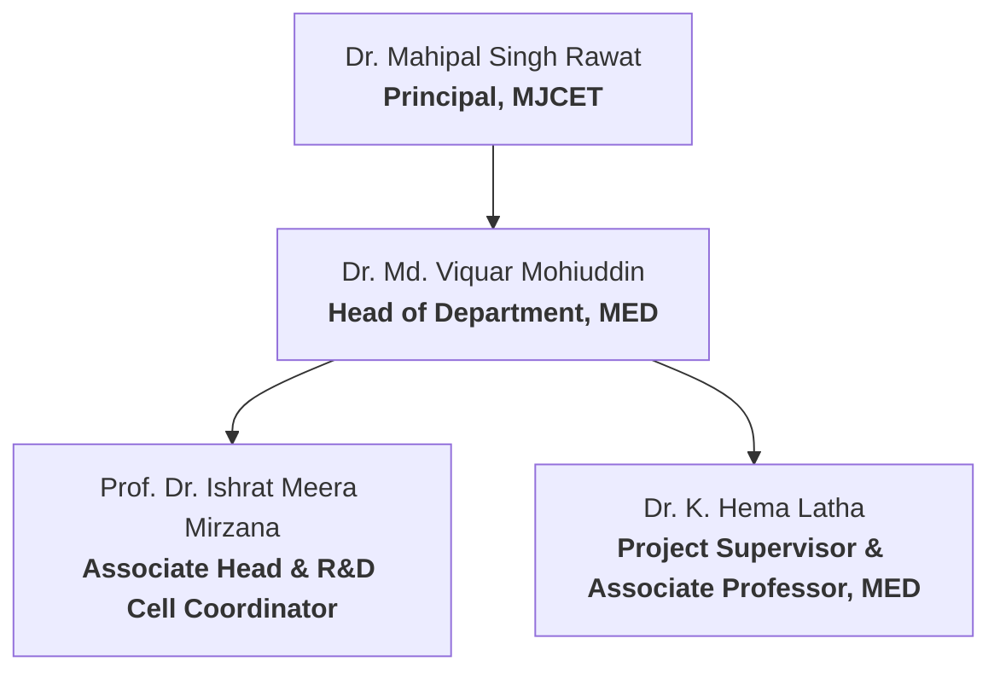
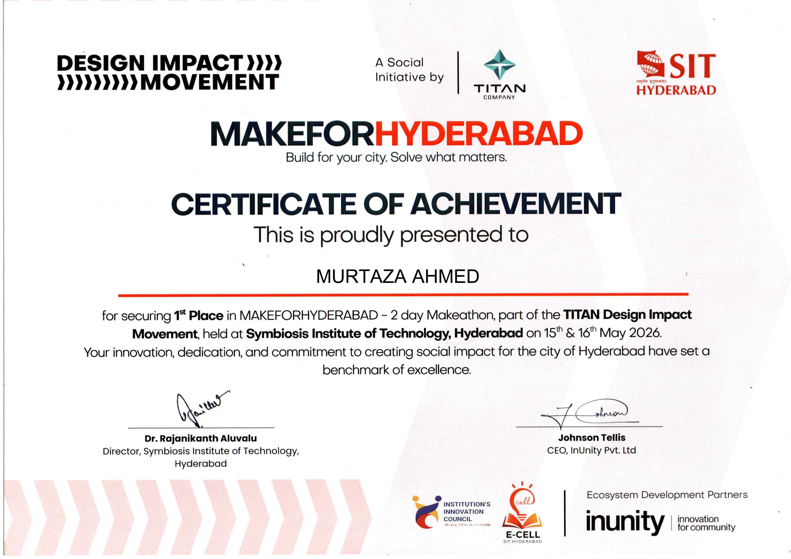

import { Badge } from '@astrojs/starlight/components';

This section details the academic oversight, student team composition, institutional credentials, and supervisory approval metadata associated with the development of the **Smart Agri Four Legged Bot** (2024-2025).

---

## Institutional Metadata

| Metric | Detail |
| :--- | :--- |
| **Institution** | Muffakham Jah College of Engineering and Technology (MJCET) |
| **Location** | Banjara Hills, Hyderabad - 500034, Telangana, India |
| **Affiliation** | Affiliated to Osmania University, Hyderabad |
| **Approvals & Accreditations** | Approved by AICTE, Accredited by NBA |
| **Academic Division** | Department of Mechanical Engineering (MED) |
| **Research Context** | Research and Development Cell (R&D) Project Completion Report |
| **Academic Program** | Bachelor of Engineering in Mechanical Engineering |
| **Academic Year** | 2024–2025 |

---

## Academic Guidance & Leadership

The project was carried out under the direct guidance, review, and administrative support of the following faculty members:

*   **Project Supervisor**: **Dr. K. Hema Latha** (Associate Professor, MED, MJCET)
*   **Head of Department (MED)**: **Dr. Md. Viquar Mohiuddin** (Professor and Head, MED, MJCET)
*   **Project & R&D Coordinator**: **Prof. Dr. Ishrat Meera Mirzana** (Associate Head & R&D Cell Coordinator, MJCET)
*   **Institutional Leadership**: **Dr. Mahipal Singh Rawat** (Principal, MJCET)

---

## Student Project Team

Below is the list of undergraduate mechanical engineering students who designed, simulated, fabricated, and tested the robotic system:

| Student Name | Hall Ticket Number | Department/Section | Role & Key Contributions |
| :--- | :--- | :--- | :--- |
| **Mohammed Zainul Abedin Kaleemi** | 1604-24-736-041 | Mechanical Engineering | Team Lead, CAD Design, and System Architecture. |
| **Mohammed Qubaib** | 1604-24-736-017 | Mechanical Engineering | Structural Steel Fabrication, FEA Stress Simulation, and Analysis. |
| **Mohammed Muzzammil** | 1604-24-735-026 | Mechanical Engineering | Edge ML Pipeline Deployment, Arduino Motor Logic, and Control. |
| **Syed Faisal** | 1604-24-736-039 | Mechanical Engineering | Power Supply Systems, Sensor Calibration, and Field Testing. |

---

## Awards & Achievements

The **Smart Agri Four Legged Bot** (Team SAFL-B) was entered into the city-wide **MAKEFORHYDERABAD** 2-Day Make-a-thon competition on **15th & 16th May 2026** (held at Symbiosis Institute of Technology, Hyderabad). The event was organized as a Titan Design Impact Movement social initiative by **Titan Company**, **Symbiosis Institute of Technology (SIT)**, and **InUnity Pvt. Ltd.**

*   **Achievement**: <Badge text="1st Place Winner" variant="success" />
*   **Prize Awarded**: **₹10,000** Cash Prize to Team SAFL-B.

| Hackathon 1st Place Certificate | Cash Prize Check (Team SAFL-B) |
| :---: | :---: |
|  |  |

---

## Document Validation

> [!NOTE]
> This project has been validated and compiled as a formal dissertation in partial fulfillment of the requirements for the award of the Degree of **Bachelor of Engineering in Mechanical Engineering** at Osmania University. The project was funded by the R&D Cell Seed Funds, MJCET.

*   **Status**: <Badge text="Approved" variant="success" />
*   **Review Committee Approval**: Completed May 2025
*   **Ethics Code Compliance**: Verified mapping to Program Outcomes (PO1 to PO12) with high relevance in Engineering Knowledge (PO1), Design (PO3), Modern Tool Usage (PO5), and Sustainability (PO7).
