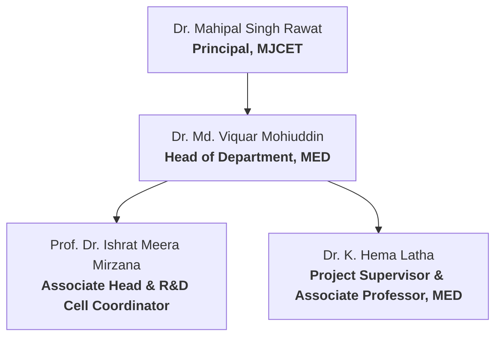

import { Badge } from '@astrojs/starlight/components';

This section details the academic oversight, student team composition, institutional credentials, and supervisory approval metadata associated with the development of the **Smart Agri Four Legged Bot** (2024-2025).

---

## Institutional Metadata

| Metric | Detail |
| :--- | :--- |
| **Institution** | Muffakham Jah College of Engineering and Technology (MJCET) |
| **Location** | Banjara Hills, Hyderabad - 500034, Telangana, India |
| **Affiliation** | Affiliated to Osmania University, Hyderabad |
| **Approvals & Accreditations** | Approved by AICTE, Accredited by NBA |
| **Academic Division** | Department of Mechanical Engineering (MED) |
| **Research Context** | Research and Development Cell (R&D) Project Completion Report |
| **Academic Program** | Bachelor of Engineering in Mechanical Engineering |
| **Academic Year** | 2024–2025 |

---

## Academic Guidance & Leadership

The project was carried out under the direct guidance, review, and administrative support of the following faculty members:

*   **Project Supervisor**: **Dr. K. Hema Latha** (Associate Professor, MED, MJCET)
*   **Head of Department (MED)**: **Dr. Md. Viquar Mohiuddin** (Professor and Head, MED, MJCET)
*   **Project & R&D Coordinator**: **Prof. Dr. Ishrat Meera Mirzana** (Associate Head & R&D Cell Coordinator, MJCET)
*   **Institutional Leadership**: **Dr. Mahipal Singh Rawat** (Principal, MJCET)

---

## Student Project Team

Below is the list of undergraduate mechanical engineering students who designed, simulated, fabricated, and tested the robotic system:

| Student Name | Hall Ticket Number | Department/Section | Role & Key Contributions |
| :--- | :--- | :--- | :--- |
| **Syed Murtaza Ahmed** | 1604-24-736-017 | Mechanical Engineering | Principal System Architect: End-to-end electrical design, control software development, and edge ML pipeline integration. |
| **Mohammed Zainul Abedin Kaleemi** | 1604-24-736-041 | Mechanical Engineering | CAD modeling, mechanical layout design, and primary team-to-faculty advisor coordinator. |
| **Mohammed Muzzammil** | 1604-24-736-039 | Mechanical Engineering | CAD modeling, mechanical layout design, and assembly layout integration. |
| **Mohammed Qubaib** | 1604-24-735-026 | Electronics & Communication | Electrical system wiring, sensor integration, hardware harnesses, and project logistics coordination. |
| **Syed Faisal** | 1604-24-736-029 | Mechanical Engineering | Hands-on chassis fabrication, welding, structural assembly, and project operations logistics. |

---

## Awards & Achievements

The **Smart Agri Four Legged Bot** (Team SAFL-B) was entered into the city-wide **MAKEFORHYDERABAD** 2-Day Make-a-thon competition on **15th & 16th May 2026** (held at Symbiosis Institute of Technology, Hyderabad). The event was organized as a Titan Design Impact Movement social initiative by **Titan Company**, **Symbiosis Institute of Technology (SIT)**, and **InUnity Pvt. Ltd.**

*   **Achievement**: <Badge text="1st Place Winner" variant="success" />
*   **Prize Awarded**: **₹10,000** Cash Prize to Team SAFL-B.

| Hackathon 1st Place Certificate | Cash Prize Check (Team SAFL-B) |
| :---: | :---: |
|  |  |

---

## Project Development Timeline (Appendix I)

The project followed a structured lifecycle from concept and requirement analysis to field testing and final thesis binding:

| Phase | Time Frame | Activities | Deliverables |
| :--- | :--- | :--- | :--- |
| **Phase 1** | November 2024 | Problem identification, requirement analysis, initial farm visits. | Project objective definition, preliminary report. |
| **Phase 2** | December 2024 | Conceptual sketches, CAD modeling of bot structure and components. | Initial mechanical design with 3D models. |
| **Phase 3** | January 2025 | Finite Element Analysis (FEA), stress validation, design optimization. | FEA reports, validated CAD model. |
| **Phase 4** | February 2025 | Fabrication of chassis (steel), 3D printing of mounts and sensor enclosures. | Fully built mechanical framework. |
| **Phase 5** | March 2025 | Hardware integration (Jetson Nano, RealSense, soil probe), wiring, vibration damping. | Assembled robotic platform with integrated systems. |
| **Phase 6** | April 2025 | Software deployment, ML model integration, Amici sensor calibration. | Functional ML-ready robot, calibrated sensors. |
| **Phase 7** | May 1–10, 2025 | Field testing, results recording, final report preparation, and documentation. | Testing reports, final bound thesis. |

---

## Relevance to Environment, Safety, & Ethics (Appendix II)

The project contributions were mapped against the standard National Board of Accreditation (NBA) **Program Outcomes (PO1 to PO12)** to evaluate relevance to engineering practice, society, and sustainability:

*(Mapping scale: 3 = Highly Relevant, 2 = Moderately Relevant, 1 = Less Relevant, — = Not Relevant)*

| Program Outcome | Mapping | Project Contribution |
| :--- | :---: | :--- |
| **PO1: Engineering Knowledge** | **3** | Applied mechanical design, electronics integration, and edge ML principles to solve real-world agricultural automation challenges. |
| **PO2: Problem Analysis** | **3** | Analyzed field requirements and translated them into specific mechanical, electrical, and software specifications. |
| **PO3: Design/Development of Solutions** | **3** | Engineered a modular, stable, and terrain-adaptable quadruped wheeled robot chassis addressing specific farming needs. |
| **PO4: Conduct Investigations of Complex Problems** | **2** | Performed FEA-based structural stress/deflection simulations and validated them against physical field data. |
| **PO5: Modern Tool Usage** | **3** | Utilized CAD (SolidWorks), FEA (SolidWorks Simulation), edge computing hardware, PyTorch ML models, and digital calipers. |
| **PO6: The Engineer and Society** | **2** | Aimed to address rural labor shortages and improve farm productivity, contributing positive social value. |
| **PO7: Environment and Sustainability** | **3** | Promotes sustainable farming practices by enabling targeted weed treatment and reducing chemical overuse in fields. |
| **PO8: Ethics** | **2** | Conducted testing with high regard for operator safety, electrical isolation, and verified academic integrity of research. |
| **PO9: Individual and Team Work** | **3** | Executed in a multidisciplinary team setting with shared tasks across mechanical fabrication, electronics design, and software. |
| **PO10: Communication** | **2** | Prepared design documents, technical schematics, and delivered final presentations to academic reviewers. |
| **PO11: Project Management and Finance** | **2** | Managed component procurement, 3D printing schedules, and assembly timelines under a limited budget. |
| **PO12: Life-Long Learning** | **2** | Gained hands-on cross-disciplinary engineering capabilities (edge GPU logic, CAD/FEA sync) through self-directed learning. |

---

## Document Validation

> [!NOTE]
> This project has been validated and compiled as a formal dissertation in partial fulfillment of the requirements for the award of the Degree of **Bachelor of Engineering in Mechanical Engineering** at Osmania University. The project was funded by the R&D Cell Seed Funds, MJCET.

*   **Status**: <Badge text="Approved" variant="success" />
*   **Review Committee Approval**: Completed May 2025
*   **Ethics Code Compliance**: Verified mapping to Program Outcomes (PO1 to PO12) with high relevance in Engineering Knowledge (PO1), Design (PO3), Modern Tool Usage (PO5), and Sustainability (PO7).
