## Project Abstract

The **Smart Agri Four Legged Bot** is a semi-autonomous agricultural robot designed to support precision farming through automated weed detection and in-situ soil condition monitoring. The project emphasizes modularity, mechanical reliability, and ease of maintenance under real-world agricultural constraints.

| Symmetrical CAD Overview | Top-Left Render View |
| :---: | :---: |
| 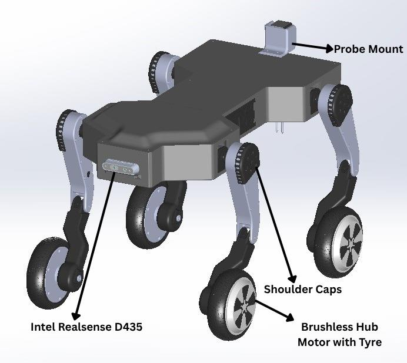 | 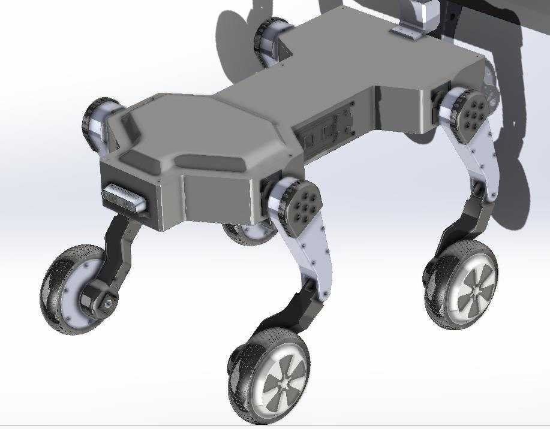 |

The robot is engineered around a hybrid fabrication approach:
1. **Mechanical Substructure**: A robust, laser-cut 3mm mild steel chassis reinforced with bottom plates and connected to four articulated planar legs.
2. **Electronics & Computing**: An **NVIDIA Jetson Nano** single-board computer acts as the central brain, handling visual input from an **Intel RealSense D435** depth camera and serial telemetry from an **Amici Sense** soil probe.
3. **Actuation & Low-Level Control**: An **Arduino Due** manages low-level motor control, driving four planetary geared DC motors for shoulder articulation and two distal brushless hub motors for locomotion.

---

## Project Objectives

*   **Terrain Adaptability**: Design a mechanically stable, terrain-capable chassis optimized for uneven, sloped agricultural fields.
*   **Structural Verification**: Validate the mechanical load paths, stress limits, and deflections using Finite Element Analysis (FEA) to guarantee structural safety.
*   **Hybrid Fabrication**: Construct load-bearing structures with steel while using FDM 3D printing (PETG/PLA+) for lightweight, non-structural covers and sensor enclosures.
*   **Vision-Based Weed Detection**: Integrate a real-time ML pipeline using deep learning (lightweight CNN) for weed bounding box classification on the edge.
*   **Precision Soil Probe**: Integrate an in-ground multi-parameter sensor to measure soil health parameters without tipping or stability issues.
*   **Resilient Electrical System**: Implement EMI signal isolation, separate power rails, and robust wiring layouts to ensure continuous field operation.

---

## System Architecture

The following block diagram illustrates the information flow, power rails, and control interfaces of the robot:

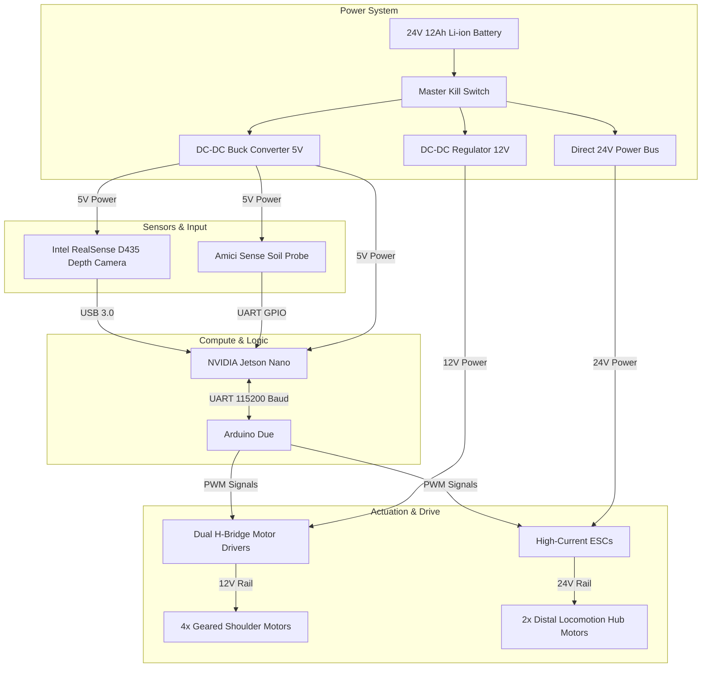

### Internal Layout CAD Detail

The internal layout was designed to separate data processing units from high-current power electronics to minimize EMI and facilitate thermal convection.

| Internal Layout Cutaway | Bottom View with Stiffeners |
| :---: | :---: |
| 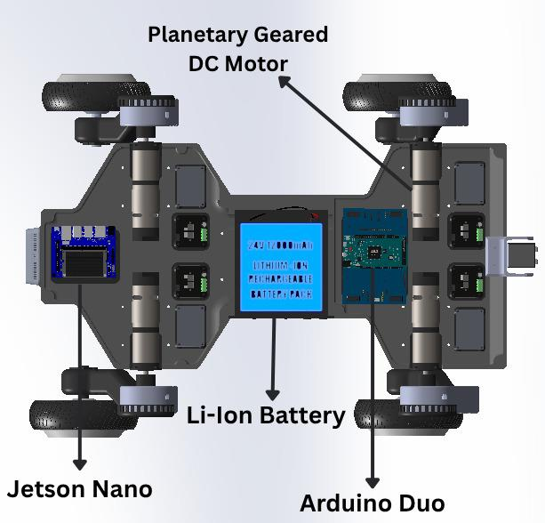 | 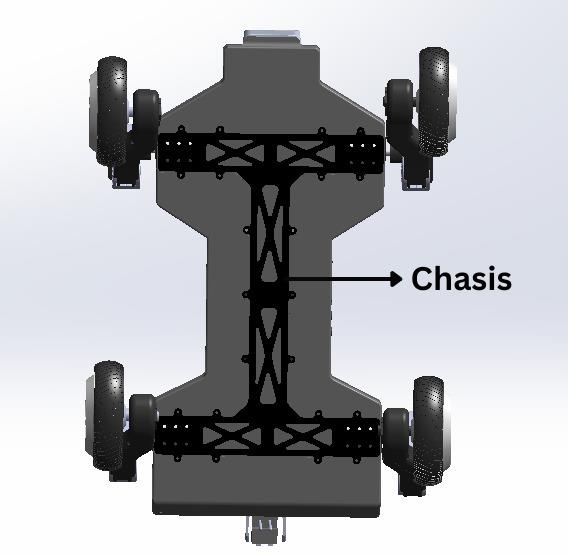 |

---

## Kinematics & Leg Articulation

The robot's planar legs are articulated in three segments, allowing the body to adjust its pitch and ground height to maintain vertical camera stability and traction over sloped terrain.

| Left Side View (Inclined Posture) | Right Side View (Neutral Posture) |
| :---: | :---: |
| 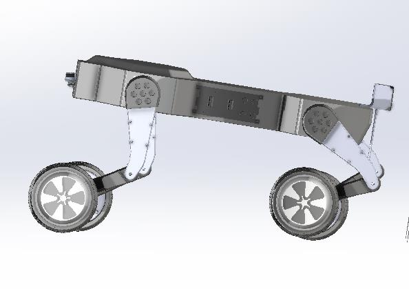 | 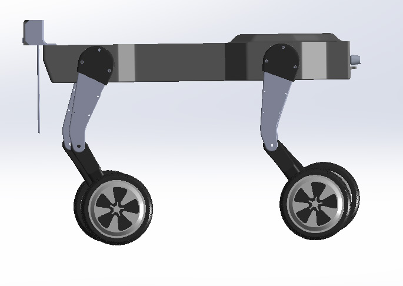 |

*   **Extended Layout (Declined configuration for downhill locomotion)**:
    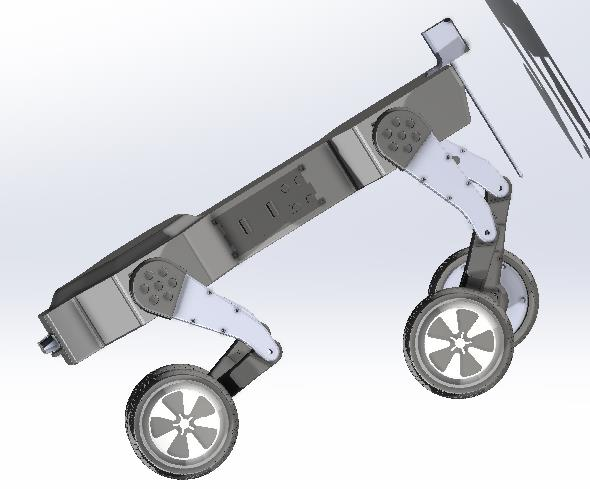

### Leg Mechanical Linkages & Compliance

Each planar leg is engineered as a modular three-joint assembly (Hip, Knee, and Foot) with passive compliance and internal routing pathways:

*   **Torsional Spring compliance**: A torsional spring joint is embedded in the knee joint housing to act as a passive compliance mechanism, helping to absorb ground vibration and keep traction over uneven profiles.
*   **Split-Piece Routing Layout**: Thigh and shin segments feature a split-piece layout that allows routing high-current lines and encoder cables internally, protecting wires from exposure and mechanical wear.

| Exploded Leg-Wheel Assembly | Leg Module CAD Detail | Knee Joint Torsional Spring |
| :---: | :---: | :---: |
| 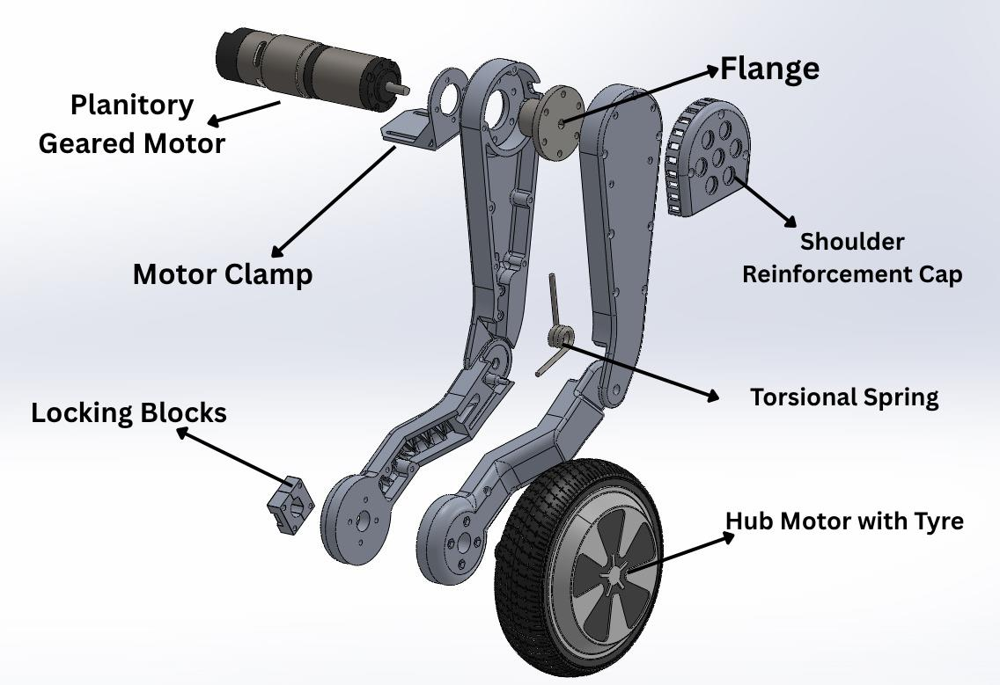 | 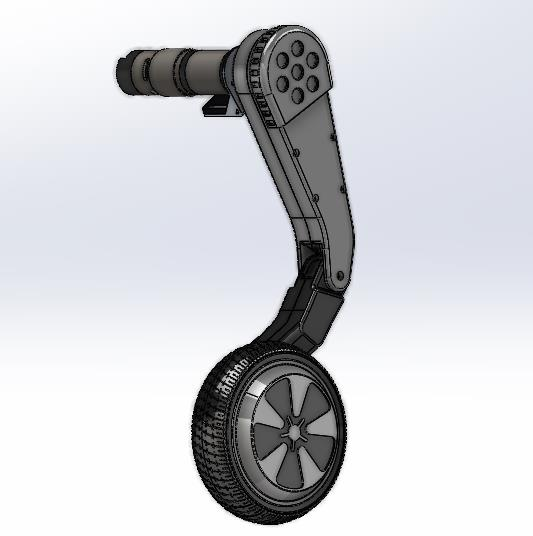 | 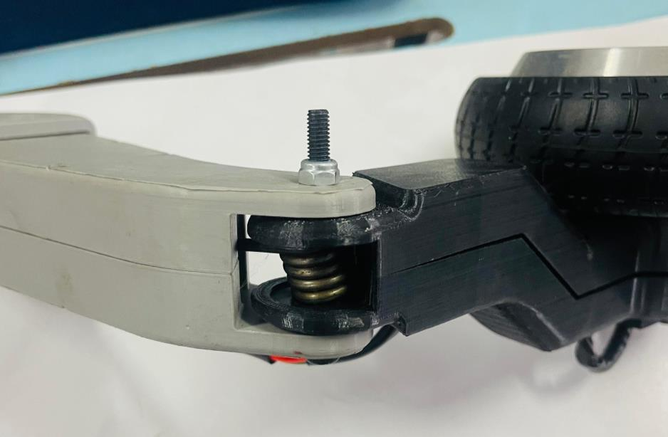 |

| Shin Routing (Inner seat) | Shin Routing (Outer seat) | Thigh Routing (Inner seat) | Thigh Routing (Outer seat) |
| :---: | :---: | :---: | :---: |
| 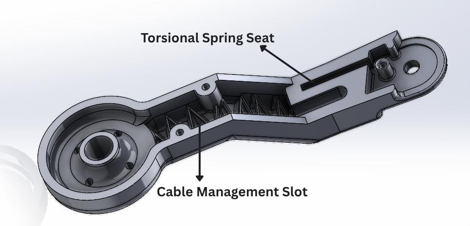 | 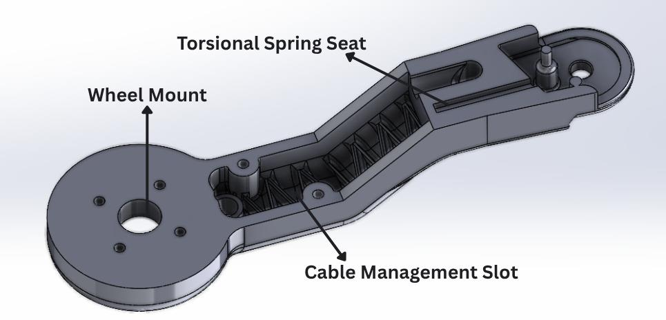 | 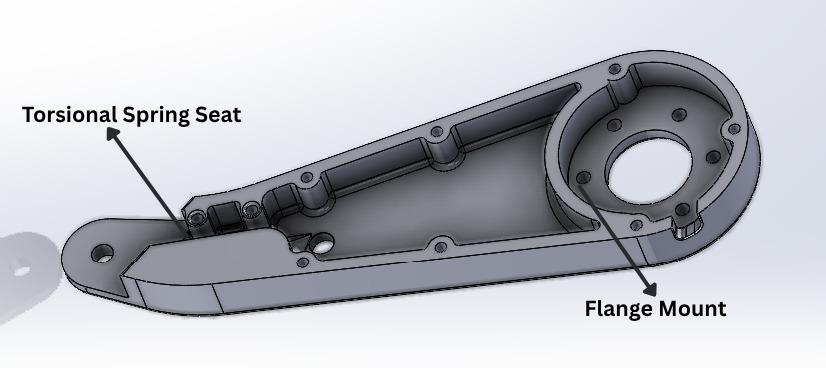 | 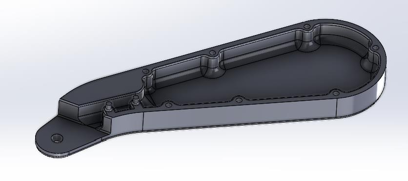 |

| Shin-to-Wheel Linkage |
| :---: |
| 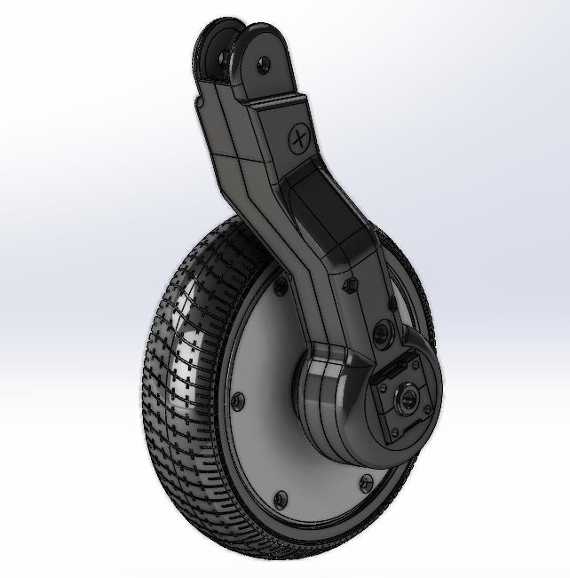 |

---

## Key Hardware Summary

| Component | Specification | Purpose |
| :--- | :--- | :--- |
| **NVIDIA Jetson Nano** | Embedded GPU computer (Ubuntu 18.04 + PyTorch) | Runs CNN weed detection, logs soil data, sends movement commands. |
| **Arduino Due** | 32-bit ARM Cortex-M3 microcontroller (84 MHz) | Performs real-time low-level motor actuation and sync. |
| **Intel RealSense D435** | RGB-D Active Infrared Stereo depth camera | Captures depth profiling and RGB frames for ML inference. |
| **Amici Sense Probe** | Dual 180mm stainless steel probes | Measures soil moisture, pH, fertility, temperature, light, and humidity. |
| **Geared DC Motors** | 4x planetary geared units | Drives shoulder joints for body height and pitch adjustments. |
| **Brushless Hub Motors** | 2x 36V 350W direct-drive wheels | Distal foot units providing primary forward and reverse locomotion. |

---

## Project Photo Gallery

Below are selected high-resolution photographs taken during the assembly and field testing phase of the physical prototype:

| Completed Prototype Assembly | Laboratory Assembly Workbench |
| :---: | :---: |
| 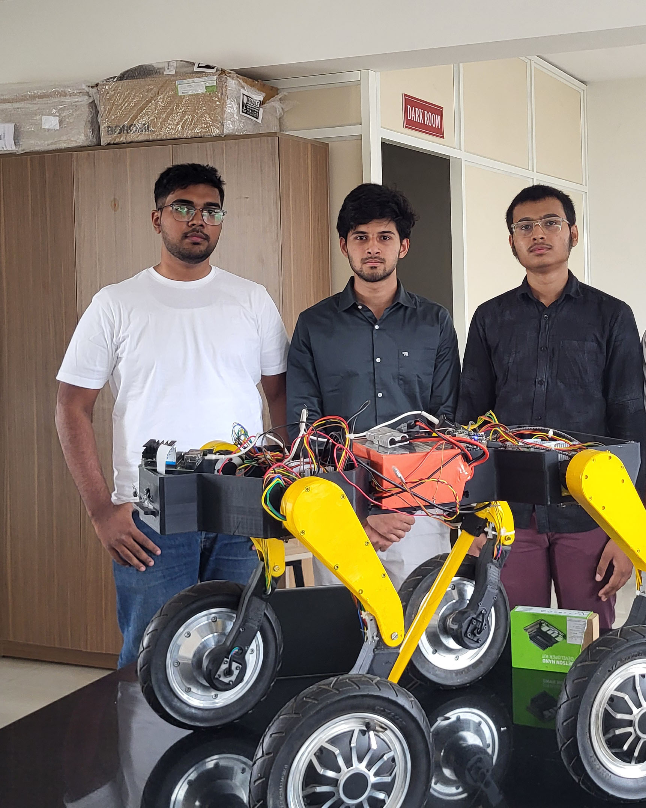 | .jpg) |
| **Internal Compartments Layout** | **Early Prototype Stage** |
| .jpg) |  |

