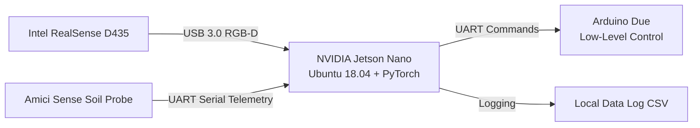
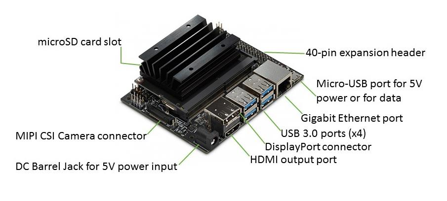
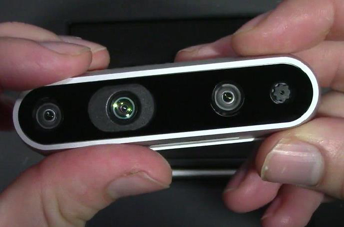
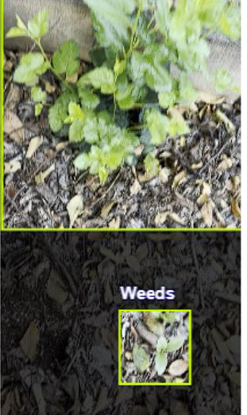
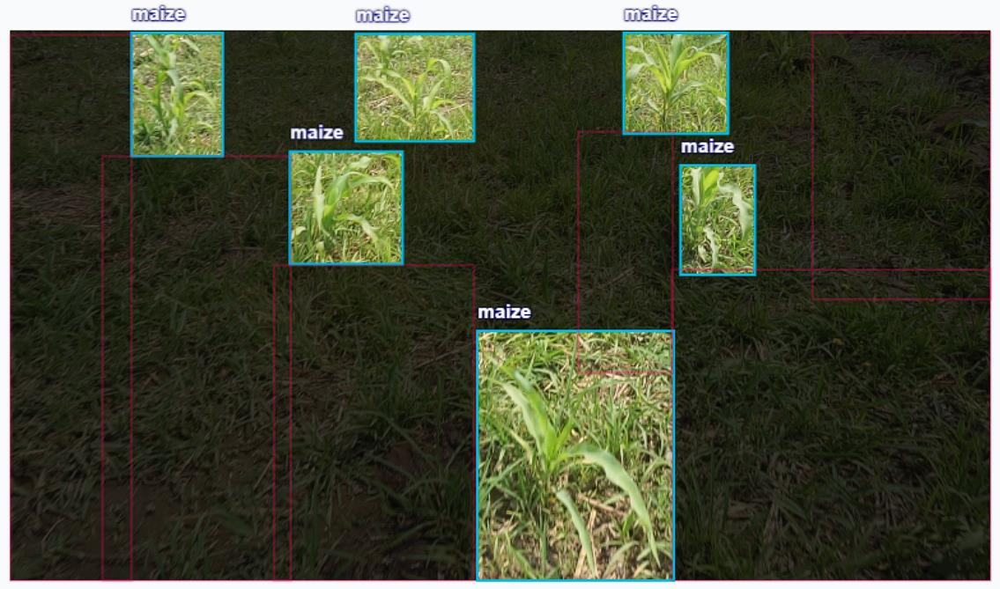
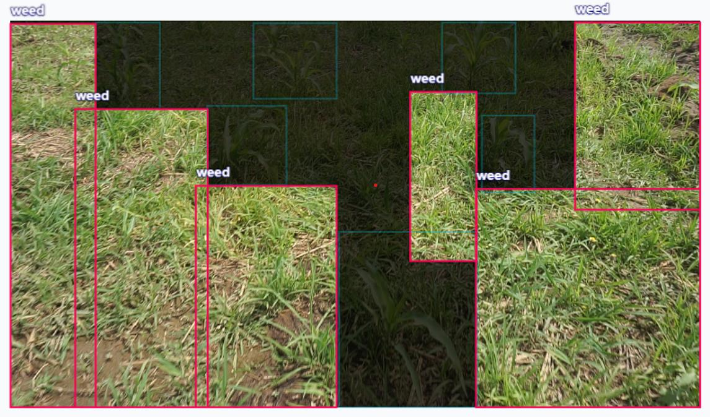
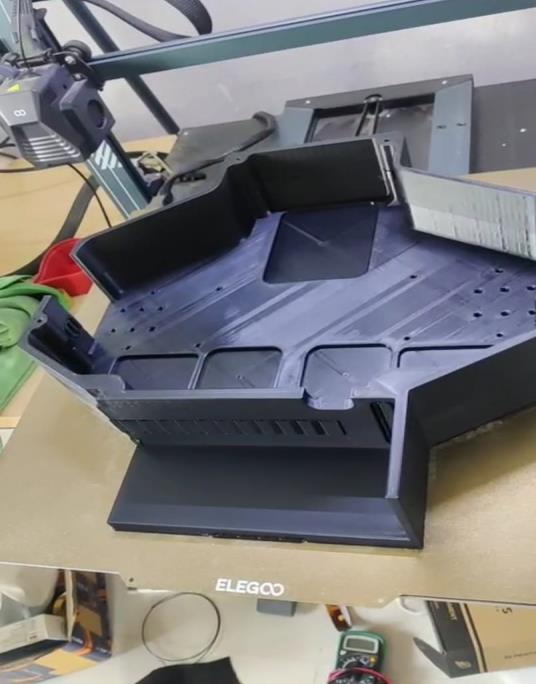
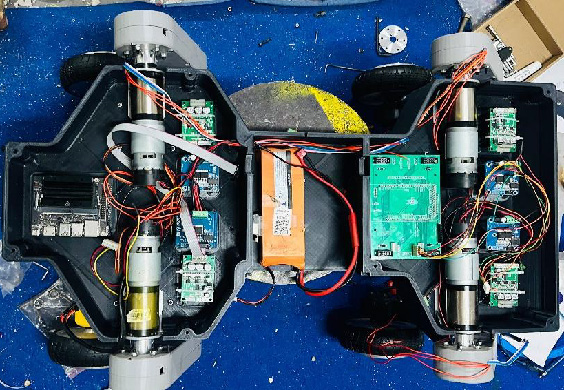
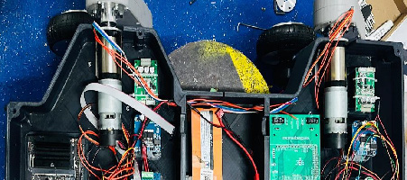
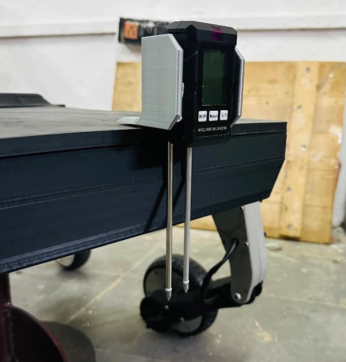

This document summarizes the edge machine learning (ML) pipeline benchmarks, hardware-software configurations, and soil probe telemetry data integrated into the **Smart Agri Four Legged Bot**.

---

## 1. Embedded Compute & Vision Configuration

The machine learning system is deployed directly at the edge to enable real-time detection without depending on cloud processing.

*   **Central Processor**: **NVIDIA Jetson Nano** running Ubuntu 18.04 LTS (JetPack SDK)
    
*   **Deep Learning Backend**: PyTorch
*   **Primary Perception Sensor**: **Intel RealSense D435** depth camera
    
    *   **Data Channels**: RGB frames fused with Active Infrared Stereo depth maps
    *   **Interface**: USB 3.0
    *   **Mounting Alignment**: Centered on chassis axis, pitched downward at **10°** (adjusted from 15° to optimize near-field crop zone coverage between the front wheels)

---

## 2. ML Inference Pipeline Benchmarks

The weed detection task uses a lightweight Convolutional Neural Network (CNN) trained to identify broad-leaf weed clusters around maize crops.

| Performance Metric | Benchmarked Value | Environment |
| :--- | :--- | :--- |
| **Input Image Resolution** | 640 × 480 pixels | Outdoor RGB-D |
| **Average Inference Latency** | **135 ms** per frame | Over 5-frame average |
| **Static Pipeline Frame Rate** | **9.2 FPS** | Benchmarked stationary |
| **In-Field Traversal Frame Rate**| **5.0 FPS** | Under continuous motion |
| **Detection Accuracy** | **>88.0%** | Broad-leaf weed cluster classification |
| **Power Consumption** | **9.6 W** (Peak) | Jetson Nano + RealSense Camera active |

### Bounding Box Detection Outputs

| Real-Time Bounding Box Detection | Crop Zone Visual Boundaries |
| :---: | :---: |
|  |  |

*   **Selective Detection of Weeds**:
    

---

## 3. Vibration & Jitter Mitigation

To prevent camera shake from causing image blur and ML misclassifications, the robot uses a dual mechanical-software stabilization strategy:

### Mechanical Countermeasures
*   **Vibration Isolators**: Integrated rubber washers on all camera bracket bolt threads.
*   **Damping Spacers**: High-density foam inserts underneath the battery pack and Jetson base plate.
*   **Balance Counterweights**: Geometrically balanced motor shaft mounts to reduce rotational resonance.

### Software Countermeasures
*   **RealSense Frame Averaging**: Averaging consecutive depth frames to eliminate high-frequency noise.
*   **Confidence Filtering**: A **3-frame rolling average** is computed before confirming weed bounding box triggers.
*   **Sensor Telemetry Sync**: Arduino halts locomotion motors during soil probe insertion to completely eliminate vibration noise during serial telemetry transmission.

---

## 4. Hardware System Integration & Wiring

A structured electrical base plate separates signal lines and motor supplies.

| Base Plate Layout | Power & Switching Layout |
| :---: | :---: |
|  |  |

*   **Cable Routing Layout**:
    

---

## 5. Soil Probe Telemetry Data

The **Amici Sense** soil analysis system logs soil parameters. telemetries are parsed via Python and combined with ML outputs in a CSV file.

### Telemetry Hardware Integration
*   **Power Rail**: 5V rail stepped down via DC-DC buck converter.
*   **Data Bus**: Serial UART communication with Jetson Nano GPIO, utilizing level shifters to step 5V signals down to Jetson-safe 3.3V levels.
*   **Response Time**: `< 5 seconds` per measurement cycle.

*   **Rear Mount Insertion Detail**:
    

### Field Logs (Three Consecutive Trials)

| Measured Parameter | Trial A | Trial B | Trial C | Average | Unit |
| :--- | :---: | :---: | :---: | :---: | :--- |
| **Soil Moisture** | 13.2 | 12.9 | 13.5 | **13.20** | % |
| **Soil pH** | 6.3 | 6.2 | 6.4 | **6.30** | — |
| **Electrical Conductivity (EC)**| 478 | 484 | 470 | **477.33** | µS/cm |
| **Soil Temperature** | 33.4 | 33.8 | 33.1 | **33.43** | °C |
| **Sunlight Intensity** | 30,800 | 31,200 | 32,100 | **31,366.67** | Lux |
| **Air Humidity** | 55.4 | 56.1 | 54.7 | **55.40** | % RH |

> [!IMPORTANT]
> The soil probe is automatically triggered to take readings when a stop command is issued following a confirmed weed classification. The combined payload of visual data and chemical soil telemetry is saved locally with timestamps for precision farming mapping.
