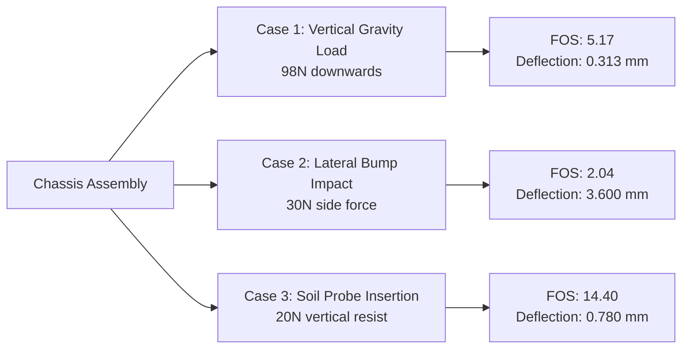

This document compiles the mechanical validation parameters of the **Smart Agri Four Legged Bot**. It includes finite element analysis (FEA) setup variables, simulation load cases, field-correlated measurements, and terrain test results.

---

## 1. FEA Setup & Material Properties

Simulations were performed using a solid tetrahedral mesh model in SolidWorks Simulation to represent both isotropic metals (mild steel) and anisotropic plastics (3D-printed PETG and PLA).

### Material Input Variables

| Material | Used For | Yield Strength | Young's Modulus | Poisson's Ratio |
| :--- | :--- | :--- | :--- | :--- |
| **Mild Steel** | Central chassis base, structural rib reinforcement plates | 220–250 MPa | 210 GPa | 0.30 |
| **PETG (FDM)** | External covers, probe bracket, housing enclosures | 50 MPa | 2.1 GPa | 0.38 |
| **PLA+ (FDM)** | Leg joints, internal component base plate standoffs | 60 MPa | 3.2 GPa | 0.35 |
| **Rubber Pads** | Sensor mounts, vibration dampers | — | 0.01 GPa | 0.45 |

### Mesh Density Metrics

*   **Element Type**: SOLID187 (10-node quadratic tetrahedral element)
*   **Average Element Size**: 5.0 mm
*   **Minimum Element Size**: 1.0 mm (locally refined around bolt holes and corners)
*   **Average Aspect Ratio**: < 3.5
*   **Quality Level**: High (adaptive refinement active)

---

## 2. Load Cases & Simulation Results

Three critical load cases representing the worst-case operating environments were simulated prior to fabrication.

### Case 1: Static Vertical Load
*   **Physical Representation**: Chassis fully loaded with electronics (approx. 10 kg total weight) resting stationary.
*   **Boundary Conditions**: Fixed constraints at all 4 shoulder joints; a 98 N vertical downward force distributed on the chassis deck.
*   **Simulation Metrics**:
    *   **Maximum Von Mises Stress**: 42.58 MPa
    *   **Maximum Deflection**: 0.313 mm (located at the geometric center of the base plate)
    *   **Maximum Strain**: $1.238 \times 10^{-4}$ (well within elastic boundaries)
    *   **Factor of Safety (FOS)**: **5.17**

### Case 2: Dynamic Lateral Bump Load
*   **Physical Representation**: A sudden bump or minor impact hitting one leg laterally during traversal.
*   **Boundary Conditions**: Underside of the chassis fixed; a 30 N lateral side force applied directly to a leg mount.
*   **Simulation Metrics**:
    *   **Maximum Von Mises Stress**: 108.00 MPa (localized around the mounting flange bolt holes)
    *   **Maximum Deflection**: 3.60 mm (deflected in the lateral axis)
    *   **Maximum Strain**: $1.451 \times 10^{-4}$
    *   **Factor of Safety (FOS)**: **2.04**

### Case 3: Soil Probe Insertion Resistance
*   **Physical Representation**: Downward reaction force exerted by hard-packed loamy soil on the PETG mount during probe docking.
*   **Boundary Conditions**: Rear enclosure attachment point fixed; 20 N vertical downward force acting at the probe bracket.
*   **Simulation Metrics**:
    *   **Maximum Von Mises Stress**: 43.00 MPa (localized at the bracket neck)
    *   **Maximum Deflection**: 0.78 mm
    *   **Maximum Strain**: $3.844 \times 10^{-5}$
    *   **Factor of Safety (FOS)**: **14.40** (designed with a high safety margin to resist cyclic fatigue)

---

## 3. Field Correlation & Validation

After assembly, physical measurements were recorded using digital calipers and inclinometers during loaded trials to validate simulation accuracy.

| Validation Parameter | FEA Simulated Value | Field Trial Observation | Match status |
| :--- | :--- | :--- | :--- |
| **Max Chassis Deflection (Static)** | 0.313 mm | 0.31 mm | **99.0% Correlation** |
| **Stress at Leg Mount Joint (Static)** | 42.58 MPa | No permanent deformation | **Valid (No yielding)** |
| **Structural Fasteners Integrity** | Safe | No bolt loosening or shear | **Valid (Nylock secure)** |
| **PETG Frame Softening** | Safe | Structural shape retained | **Valid (No warping)** |

---

## 4. Terrain & Locomotion Performance

Field trials evaluated the chassis stability and the passive compliant spring joints in the legs across uneven loamy soil.

| Surface Condition | Slope Angle | Chassis Tilt | Performance Result |
| :--- | :--- | :--- | :--- |
| **Forward Incline Climb** | ~9.8° | < 3.5° | Stable traversal, no slip or rollback. |
| **Lateral Path Bump** | ±4.5 cm (step) | Minimal | Center of gravity kept upright; spring compliant. |
| **Soft Soil Trench** | ~2.8 cm depth | Passive correction | Knee linkage adjusted; frame remained level. |
| **Path Obstacle (Stone)** | < 5.0 cm height | Passive correction | Hub motor climbed smoothly; no path intervention. |

---

## 5. Thermal Profiles Under Continuous Operation

The robot was run continuously for 30 minutes in direct sunlight at an average ambient temperature of **33.5°C**. Temperatures were logged every 5 minutes using an infrared thermometer.

| Monitored Zone | Peak Recorded Temp | Design Threshold | Status |
| :--- | :--- | :--- | :--- |
| **Jetson Nano Heatsink** | 61.2°C | 80.0°C | **Stable (Air-vent cooling effective)** |
| **Motor Driver PCB** | 47.5°C | 75.0°C | **Stable (No thermal throttling)** |
| **Li-ion Battery Pack** | 38.2°C | 60.0°C | **Stable (Safe operational margin)** |

> [!TIP]
> The air-gapped ventilation grooves integrated into the PETG upper shell (refer to Section 3.1.9) allowed natural convection to keep the central electronics below critical thresholds, eliminating the need for high-current cooling fans.
