import { CardGrid, Card, Tabs, TabItem } from '@astrojs/starlight/components';

This document compiles the mechanical validation parameters of the **Smart Agri Four Legged Bot**. It includes finite element analysis (FEA) setup variables, simulation load cases, field-correlated measurements, and terrain test results.

---

## 1. FEA Setup & Material Properties

Simulations were performed using a solid tetrahedral mesh model in SolidWorks Simulation to represent both isotropic metals (mild steel) and anisotropic plastics (3D-printed PETG and PLA).

### Material Input Variables

| Material | Used For | Yield Strength | Young's Modulus | Poisson's Ratio |
| :--- | :--- | :--- | :--- | :--- |
| **Mild Steel** | Central chassis base, structural rib reinforcement plates | 220–250 MPa | 210 GPa | 0.30 |
| **PETG (FDM)** | External covers, probe bracket, housing enclosures | 50 MPa | 2.1 GPa | 0.38 |
| **PLA+ (FDM)** | Leg joints, internal component base plate standoffs | 60 MPa | 3.2 GPa | 0.35 |
| **Rubber Pads** | Sensor mounts, vibration dampers | — | 0.01 GPa | 0.45 |

### Mesh Density Metrics

*   **Element Type**: SOLID187 (10-node quadratic tetrahedral element)
*   **Average Element Size**: 5.0 mm
*   **Minimum Element Size**: 1.0 mm (locally refined around bolt holes and corners)
*   **Average Aspect Ratio**: < 3.5
*   **Mesh Quality**: High (adaptive refinement active)

---

## 2. Load Cases & Simulation Results

Three critical load cases representing the worst-case operating environments were simulated prior to fabrication.

{`
graph LR
    Chassis["Chassis Assembly"] --> Case1["Case 1: Vertical Gravity Load 98N downwards"]
    Chassis --> Case2["Case 2: Lateral Bump Impact 30N side force"]
    Chassis --> Case3["Case 3: Soil Probe Insertion 20N vertical resist"]

    Case1 --> Res1["FOS: 5.17 Deflection: 0.313 mm"]
    Case2 --> Res2["FOS: 2.04 Deflection: 3.600 mm"]
    Case3 --> Res3["FOS: 14.40 Deflection: 0.780 mm"]
`}

### Case 1: Static Vertical Load
*   **Physical Representation**: Chassis fully loaded with electronics (approx. 10 kg total weight) resting stationary.
*   **Boundary Conditions**: Fixed constraints at all 4 shoulder joints; a 98 N vertical downward force distributed on the chassis deck.
*   **Simulation Metrics**:
    *   **Maximum Von Mises Stress**: 42.58 MPa
    *   **Maximum Deflection**: 0.313 mm (located at the geometric center of the base plate)
    *   **Maximum Strain**: $1.238 \times 10^{-4}$ (well within elastic boundaries)
    *   **Factor of Safety (FOS)**: **5.17**

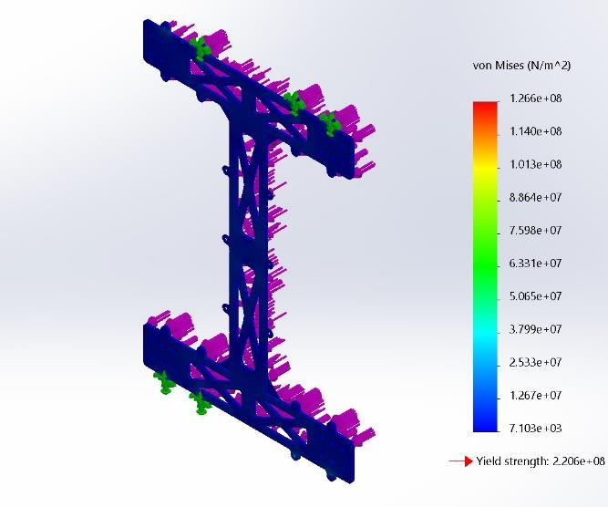

### Case 2: Dynamic Lateral Bump Load
*   **Physical Representation**: A sudden bump or minor impact hitting one leg laterally during traversal.
*   **Boundary Conditions**: Underside of the chassis fixed; a 30 N lateral side force applied directly to a leg mount.
*   **Simulation Metrics**:
    *   **Maximum Von Mises Stress**: 108.00 MPa (localized around the mounting flange bolt holes)
    *   **Maximum Deflection**: 3.60 mm (deflected in the lateral axis)
    *   **Maximum Strain**: $1.451 \times 10^{-4}$
    *   **Factor of Safety (FOS)**: **2.04**

<Tabs>
  <TabItem label="Strain Distribution">
    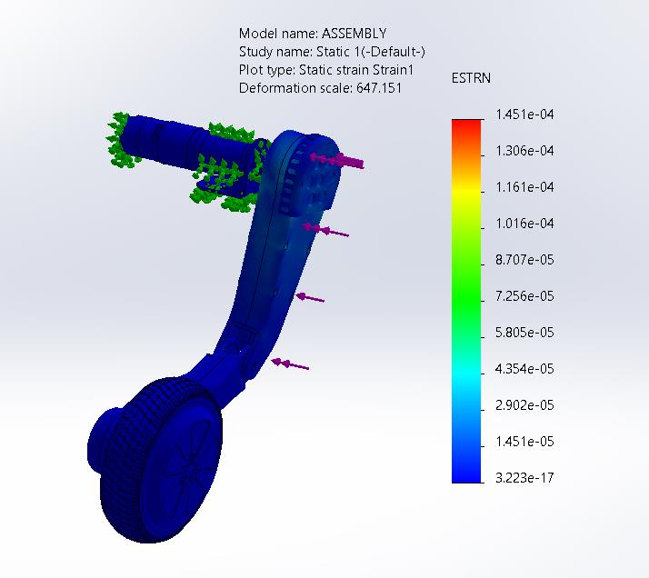
  </TabItem>
  <TabItem label="Stress Concentration">
    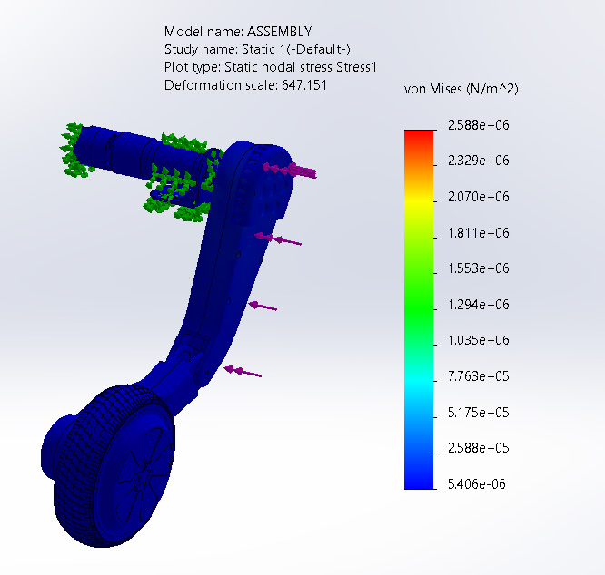
  </TabItem>
  <TabItem label="Bending Deflection">
    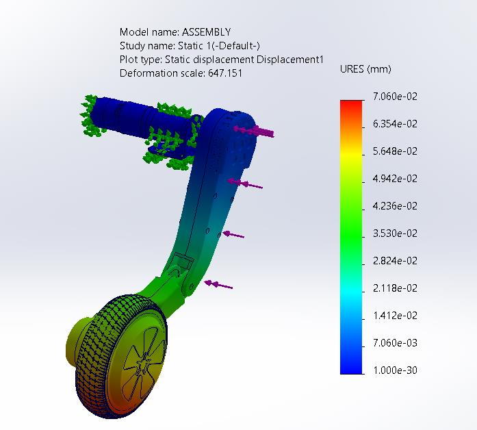
  </TabItem>
</Tabs>

### Case 3: Soil Probe Insertion Resistance
*   **Physical Representation**: Downward reaction force exerted by hard-packed loamy soil on the PETG mount during probe docking.
*   **Boundary Conditions**: Rear enclosure attachment point fixed; 20 N vertical downward force acting at the probe bracket.
*   **Simulation Metrics**:
    *   **Maximum Von Mises Stress**: 43.00 MPa (localized at the bracket neck)
    *   **Maximum Deflection**: 0.78 mm
    *   **Maximum Strain**: $3.844 \times 10^{-5}$
    *   **Factor of Safety (FOS)**: **14.40** (designed with a high safety margin to resist cyclic fatigue)

<Tabs>
  <TabItem label="Stress Concentration">
    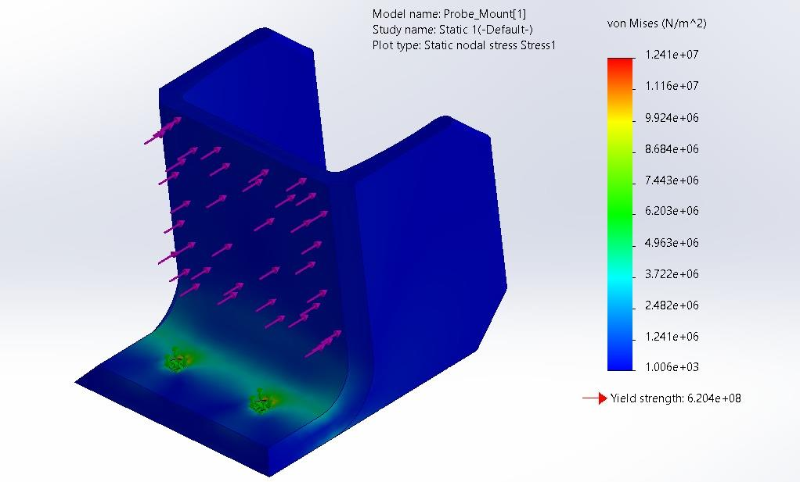
  </TabItem>
  <TabItem label="Deflection Gradient">
    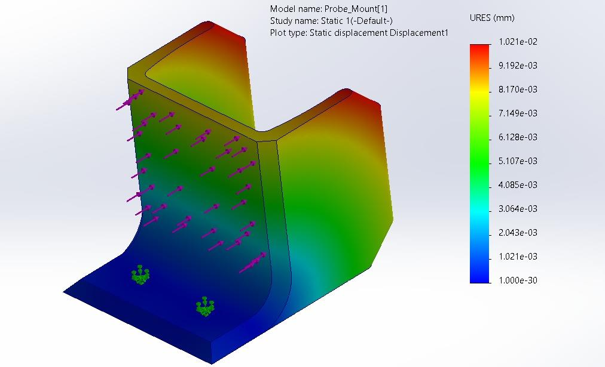
  </TabItem>
  <TabItem label="Strain Distribution">
    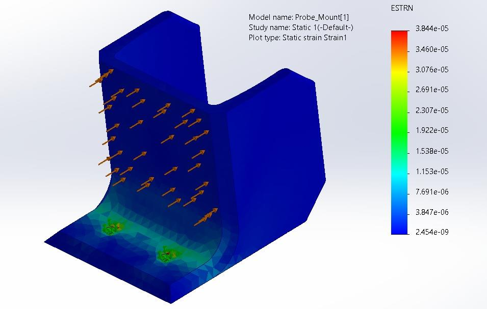
  </TabItem>
</Tabs>

### Simulation Results Feedback & Design Optimization

Based on the FEA results, several structural optimizations were identified to improve future design revisions:

| Component Area | Current Status | Suggested Design Improvement |
| :--- | :--- | :--- |
| **Leg-to-frame flange** | Single thickness plate | Add gusset plate or tapered transition to improve lateral bending resistance. |
| **Probe mount neck** | Flat profile bracket | Integrate a curved fillet/radius at the neck region to further distribute localized stress. |
| **Base ribs** | CNC-cut steel plate | Implement thickness reduction in non-critical zones to optimize overall weight. |
| **Chassis cutouts** | Decorative X-pattern cutouts | Add minor rounding to inner corners to lower localized stress spikes. |

---

## 3. Fabrication & Component Assembly

To bridge simulation and physical reality, the robot chassis base and key support links were fabricated through a hybrid approach combining metal laser cutting with FDM 3D printing.

### Materials & Components Procured

The hybrid fabrication strategy mapped specific materials and manufacturing methods to their structural or environmental needs. Below is the responsive component breakdown:

<CardGrid>
  <Card title="Chassis Frame">
    *   **Material**: Mild Steel
    *   **Method**: CNC cut + manual welding
    *   **Structural Justification**: Main load-bearing frame; provides high yield strength and torque resistance under movement.
  </Card>
  <Card title="Reinforcement Plates">
    *   **Material**: Mild Steel
    *   **Method**: CNC laser cut
    *   **Structural Justification**: Provides added torsional stiffness and distributes leg forces across the base.
  </Card>
  <Card title="Shell Enclosures">
    *   **Material**: PETG (1.75 mm)
    *   **Method**: FDM 3D Printed
    *   **Structural Justification**: Lightweight cover; provides UV, heat, and moisture resistance under direct sunlight.
  </Card>
  <Card title="Wheel Mounts & Leg Joints">
    *   **Material**: PLA+
    *   **Method**: FDM 3D Printed
    *   **Structural Justification**: Distal leg linkage; high impact resistance and rigid structural support.
  </Card>
  <Card title="Probe Mount & Bracket">
    *   **Material**: PETG
    *   **Method**: FDM 3D Printed
    *   **Structural Justification**: Holds soil analysis probe; high fatigue life under cyclic insertion loads.
  </Card>
  <Card title="Electronics Base Plate">
    *   **Material**: PLA
    *   **Method**: FDM 3D Printed (FDM)
    *   **Structural Justification**: Internal base; insulates electronics and routes cables cleanly with embedded anchors.
  </Card>
  <Card title="Wiring Accessories">
    *   **Material**: Copper + PVC
    *   **Method**: Manual assembly
    *   **Structural Justification**: Interconnects power rails and signal lines with EMI shielding.
  </Card>
</CardGrid>

### Chassis Plate Laser Cut Execution
*   **Chassis Plate**: CNC laser-cut 3mm mild steel sheet, finished with anti-rust black primer and matte coating.

<CardGrid>
  <Card title="CNC Laser Cut Setup">
    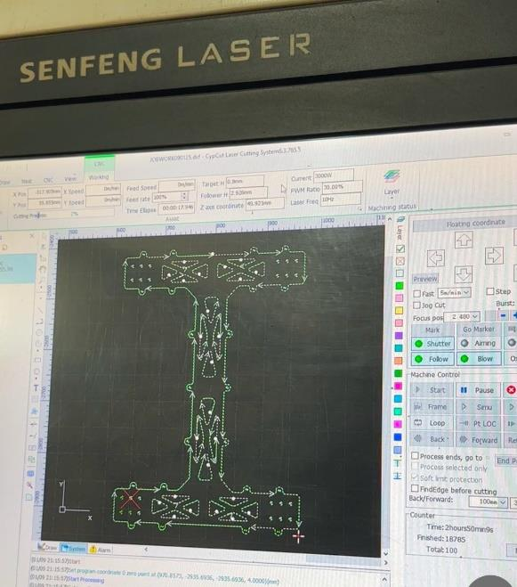
  </Card>
  <Card title="Completed Chassis Plate">
    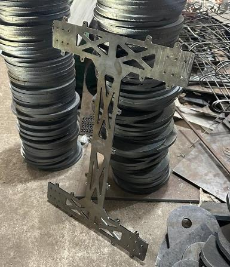
  </Card>
</CardGrid>

### 3D Printed PETG Enclosures & Mounts
*   **Venting & Enclosures**: Interlocking PETG shells printed on an Elegoo Neptune 4 Max to contain motor drivers, regulators, and sensors.
*   **Print Configuration Details**:
    *   **Layer Height**: 0.2 mm
    *   **Infill Density**: 20%
    *   **Nozzle Temperature**: 240°C
    *   **Bed Temperature**: 60°C
    *   **Slicing Details**: Ultimaker Cura slicer with brim support active to completely eliminate warping.
    *   **Local Reinforcements**: Critical stress zones like screw bosses and cable pass-through slots were printed with increased wall thickness (2.4 mm) for extra durability.

<CardGrid>
  <Card title="3D Printed Upper Enclosures">
    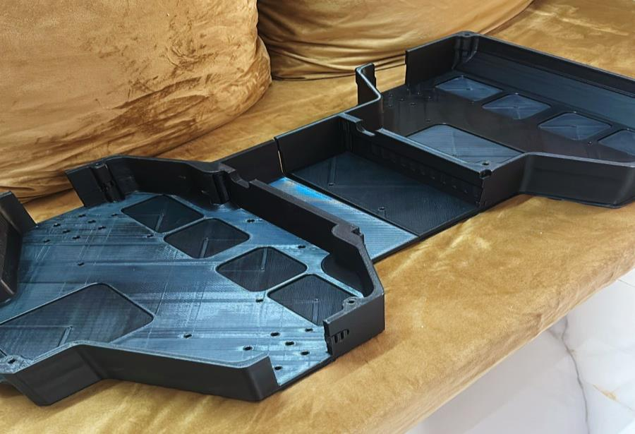
  </Card>
  <Card title="3D Printed Probe Bracket">
    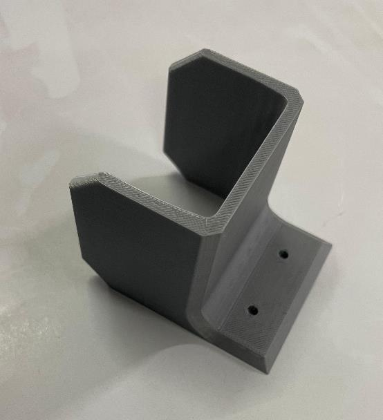
  </Card>
  <Card title="Probe Mount Assembly CAD">
    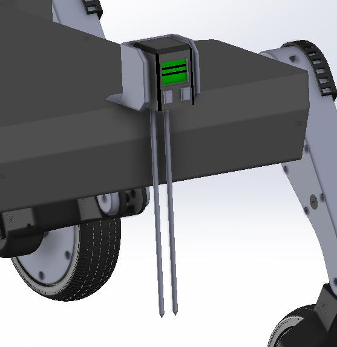
  </Card>
</CardGrid>

### Modular Leg & Shoulder Actuator Assemblies
*   **Shoulder Cap**: Magnetically mounted shoulder enclosure with neodymium magnets for tool-less drive gear checks.
*   **Distal Lock**: 3D-printed split-piece locking block to lock the brushless hub wheel shaft firmly without adhesives.

<CardGrid>
  <Card title="Magnetically Mounted Shoulder Cap">
    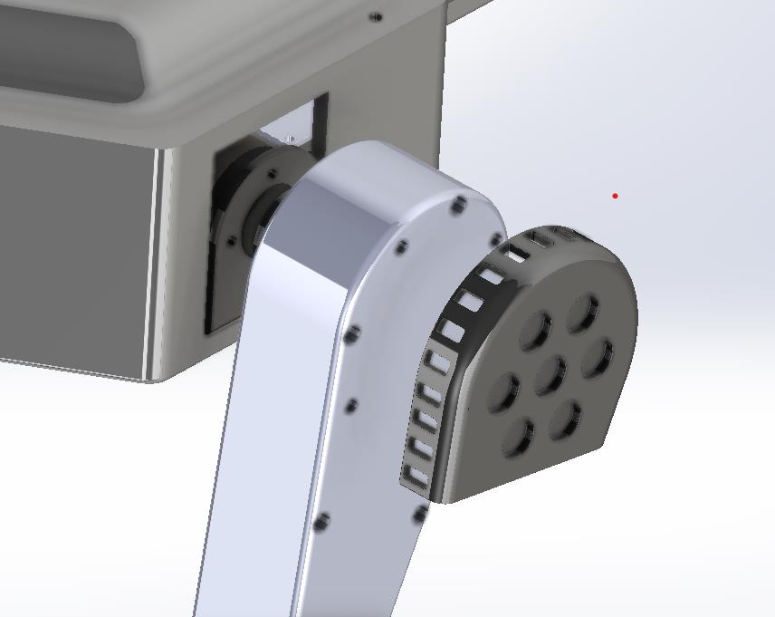
  </Card>
  <Card title="Locking Block & Leg Module">
    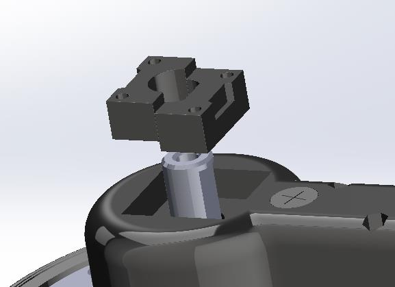
  </Card>
</CardGrid>

### Mechanical Assembly Challenges & Fixes

During the physical fabrication and calibration of the prototype, the team resolved several real-world engineering issues:

*   **Leg clearance mismatch with wheel shaft**
    *   *Root Cause*: Dimensional variation in raw hub motor shafts.
    *   *Solution Applied*: Adjusted the CAD files with a small offset and reprinted the brackets.
*   **PETG warping in large shell print**
    *   *Root Cause*: Bed adhesion failure due to uneven cooling.
    *   *Solution Applied*: Added a print brim and optimized the chamber/cooling fan settings.
*   **Motor vibration causing screw loosening**
    *   *Root Cause*: Cyclic resonance during drive motor tests.
    *   *Solution Applied*: Applied Loctite thread locker and switched to Nylock nuts on critical fasteners.

---

## 4. Field Correlation & Validation

After assembly, physical measurements were recorded using digital calipers and inclinometers during loaded trials to validate simulation accuracy.

| Validation Parameter | FEA Simulated Value | Field Trial Observation | Match status |
| :--- | :--- | :--- | :--- |
| **Max Chassis Deflection (Static)** | 0.313 mm | 0.31 mm | **99.0% Correlation** |
| **Stress at Leg Mount Joint (Static)** | 42.58 MPa | No permanent deformation | **Valid (No yielding)** |
| **Structural Fasteners Integrity** | Safe | No bolt loosening or shear | **Valid (Nylock secure)** |
| **PETG Frame Softening** | Safe | Structural shape retained | **Valid (No warping)** |

*   **Completed Leg Assembly**:
    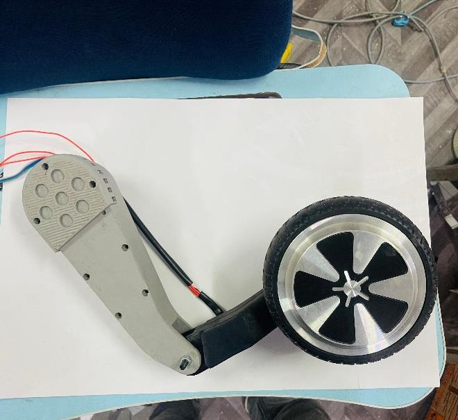

---

## 5. Terrain & Locomotion Performance

Field trials evaluated the chassis stability and the passive compliant spring joints in the legs across uneven loamy soil.

### Field Testing Setup & Objectives

Before evaluating performance, the robot was tested under representative field conditions mirroring small-scale agricultural fields.
*   **Test Area**: 18 m × 12 m dry soil field.
*   **Surface Profile**: Uneven terrain with a slope up to 10° and elevation variance of ±4.2 cm.

#### Field Conditions During Testing

| Environmental Parameter | Value / Range |
| :--- | :--- |
| **Ambient Temperature** | 31°C – 34°C |
| **Soil Moisture Content** | 13.2% (average) |
| **Relative Humidity** | 54% – 57% |
| **Maximum Slope in Field** | ~10° |
| **Soil Texture** | Loamy-dry, cracked |

#### Test Objectives & Validation Strategy

The field testing plan was structured around validating the primary objectives:

*   **Objective 1: Terrain-capable mechanical design**
    *   *Validation Method*: Motion over inclines and uneven terrain.
    *   *Quantifiable Result Status*: Climbed ~9.8° slope stably; chassis tilt kept below 3.5°.
*   **Objective 2: Structural integrity under loads**
    *   *Validation Method*: Frame deflection checks under live loads.
    *   *Quantifiable Result Status*: Caliper verified maximum deflection of 0.31 mm (99.0% correlation with FEA).
*   **Objective 3: Hybrid fabrication stability**
    *   *Validation Method*: Joint inspection post runtime.
    *   *Quantifiable Result Status*: Joint geometry remained stable; no warping or fasteners failure.
*   **Objective 4: ML-based real-time weed detection**
    *   *Validation Method*: Live Jetson Nano inference tests.
    *   *Quantifiable Result Status*: Local CNN inference speed 9.2 FPS (stationary) and 5.0 FPS (traversal).
*   **Objective 5: Sensor & electronics mounting**
    *   *Validation Method*: Vibration, heat, and fitment checks.
    *   *Quantifiable Result Status*: Air-gapped ventilation grooves kept heatsinks and drivers safe.
*   **Objective 6: System behavior under field stress**
    *   *Validation Method*: Combined endurance run (motion + thermal + data logging).
    *   *Quantifiable Result Status*: Continuous 30-minute test run completed without any subsystem failure.

### Traversal Performance Matrix

| Surface Condition | Slope Angle | Chassis Tilt | Performance Result |
| :--- | :--- | :--- | :--- |
| **Forward Incline Climb** | ~9.8° | < 3.5° | Stable traversal, no slip or rollback. |
| **Lateral Path Bump** | ±4.5 cm (step) | Minimal | Center of gravity kept upright; spring compliant. |
| **Soft Soil Trench** | ~2.8 cm depth | Passive correction | Knee linkage adjusted; frame remained level. |
| **Path Obstacle (Stone)** | < 5.0 cm height | Passive correction | Hub motor climbed smoothly; no path intervention. |

---

## 6. Thermal Profiles Under Continuous Operation

The robot was run continuously for 30 minutes in direct sunlight at an average ambient temperature of **33.5°C**. Temperatures were logged every 5 minutes using an infrared thermometer.

| Monitored Zone | Peak Recorded Temp | Design Threshold | Status |
| :--- | :--- | :--- | :--- |
| **Jetson Nano Heatsink** | 61.2°C | 80.0°C | **Stable (Air-vent cooling effective)** |
| **Motor Driver PCB** | 47.5°C | 75.0°C | **Stable (No thermal throttling)** |
| **Li-ion Battery Pack** | 38.2°C | 60.0°C | **Stable (Safe operational margin)** |

> [!TIP]
> The air-gapped ventilation grooves integrated into the PETG upper shell allowed natural convection to keep the central electronics below critical thresholds, eliminating the need for high-current cooling fans.
